# Gangs of Four (GoF) Design Patterns

## Introduction 

### What is a pattern

Design patterns are typical solutions to commonly occurring problems in software design. They are like pre-made blueprints that you can customize to solve a recurring design problem in your code.

Most patterns are described very formally so people can reproduce them in many contexts. Here are the sections that are usually present in a pattern description:

 - Intent of the pattern briefly describes both the problem and the solution.
 - Motivation further explains the problem and the solution the pattern makes possible.
 - Structure of classes shows each part of the pattern and how they are related.
 - Code example in one of the popular programming languages makes it easier to grasp the idea behind the pattern.

Some pattern catalogs list other useful details, such as applicability of the pattern, implementation steps and relations with other patterns.

### GoF

Gangs of Four Design Patterns is the collection of 23 design patterns from the book “Design Patterns: Elements of Reusable Object-Oriented Software”.


This book was first published in 1994 and it’s one of the most popular books to learn design patterns. The book was authored by Erich Gamma, Richard Helm, Ralph Johnson, and John Vlissides. It got nicknamed as Gangs of Four design patterns because of four authors. Furthermore, it got a shorter name as “GoF Design Patterns”.

### Classification 

GoF Design Patterns are divided into three categories:

1. Creational: The design patterns that deal with the creation of an object.
2. Structural: The design patterns in this category deals with the class structure such as Inheritance and Composition.
3. Behavioral: This type of design patterns provide solution for the better interaction between objects, how to provide lose coupling, and flexibility to extend easily in future.

## Creational patterns

### Abstract factory

Abstract Factory is a creational design pattern that lets you produce families of related objects without specifying their concrete classes.

#### Pros.

1. You can be sure that the products you’re getting from a factory are compatible with each other.
2. You avoid tight coupling between concrete products and client code.
3. Single Responsibility Principle. You can extract the product creation code into one place, making the code easier to support.
4. Open/Closed Principle. You can introduce new variants of products without breaking existing client code.

#### Cons. 

1. The code may become more complicated than it should be, since a lot of new interfaces and classes are introduced along with the pattern.

#### Practical examples. 

Most popular use cases in mobile development:
 - Creating families of themed UI components (e.g., light/dark mode buttons, labels, and backgrounds).
 - Generating cross-platform UI elements (iOS/macOS) with shared styling rules.
 - Creating different services depending on the env configuration.
 - Creating animations with different configurations.

Example 1. Creating some data abstract data model depending on the env for testing purposes

```swift
protocol ProductDataFactory {
    func getSomeProduct() -> ProductType
}

final class ProductionProductFactory: ProductDataFactory {
    func getSomeProduct() -> any ProductType {
        ProductionProduct()
    }
}

final class DevProductFactory: ProductDataFactory {
    func getSomeProduct() -> any ProductType {
        DevProduct()
    }
}
```
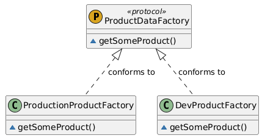

Example 2. Create different views depending on the platform

```swift
import SwiftUI

protocol ProductViewFactory {
    func getProductExtendedView(for product: ProductType) -> AnyView
    func getProductView(for product: ProductType) -> AnyView
}

final class IphoneProductsViewFactory: ProductViewFactory {
    func getProductView(for product: ProductType) -> AnyView {
        AnyView(
            HStack {
                Text(product.name)
                Spacer()
                Text(product.price.formatted(.currency(code: "USA")))
            }
                .padding()
                .frame(minHeight: 40)
                .background(Color.cyan.opacity(0.5))
        )
    }
    
    func getProductExtendedView(for product: ProductType) -> AnyView {
        AnyView(
            Text("Product extended view")
        )
    }
}

final class IPadProductsViewFactory: ProductViewFactory {
    func getProductView(for product: ProductType) -> AnyView {
        AnyView(
            HStack {
                Text(product.name)
                    .padding(.trailing, 4)
                Text(product.description)
                Spacer()
                Text(product.price.formatted(.currency(code: "USA")))
            }
                .padding()
                .frame(minHeight: 100)
                .background(Color.green.opacity(0.1))
        )
    }
    
    func getProductExtendedView(for product: ProductType) -> AnyView {
        AnyView(
            Text("Product extended view")
        )
    }
}

```

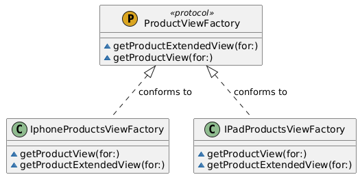

### Builder

Builder is a creational design pattern that lets you construct complex objects step by step. The pattern allows you to produce different types and representations of an object using the same construction code.

#### Pros.

1. You can construct objects step-by-step, defer construction steps or run steps recursively.
2. You can reuse the same construction code when building various representations of products.
3. Single Responsibility Principle. You can isolate complex construction code from the business logic of the product.

#### Cons. 

1. The overall complexity of the code increases since the pattern requires creating multiple new classes.

#### Practical examples. 

- Building complex network request
- Building ui components
- Constracting configuration objects
- Creting animations
- Creating multi-step flows with dynamic steps

Example 1. Building some complex quiz configuration

```swift
struct QuizQuestion {
    let question: String
    var answer: String?
}

struct QuizModel {
    var title: String = "Default name"
    var questions: [QuizQuestion] = []
    var author: String?
    var maxScore: Int?
}

final class QuizModelBuilder {
    private var quizModel: QuizModel = QuizModel()
    
    func setTitle(_ title: String) -> Self {
        var updatedModel = quizModel
        updatedModel.title = title
        self.quizModel = updatedModel
        return self
    }
    
    func appendQuestion(_ question: QuizQuestion) -> Self {
        var updatedModel = quizModel
        updatedModel.questions.append(question)
        self.quizModel = updatedModel
        return self
    }
    
    func resetQuestions() -> Self {
        var updatedModel = quizModel
        updatedModel.questions.removeAll()
        self.quizModel = updatedModel
        return self
    }
    
    func setAuthor(_ author: String?) -> Self {
        var updatedModel = quizModel
        updatedModel.author = author
        self.quizModel = updatedModel
        return self
    }
    
    func setmaxScore(_ maxScore: Int?) -> Self {
        var updatedModel = quizModel
        updatedModel.maxScore = maxScore
        self.quizModel = updatedModel
        return self
    }
    
    func build() -> QuizModel {
        quizModel
    }
}
```


Example 2. Building network request 

```swift
import Foundation

struct SomeLibraryNetworkRequest {
    var baseURL: URL?
    var queryParameters: [URLQueryItem]
    var headers: [String: String]
    
    init(
        baseURL: URL? = nil,
        queryParameters: [URLQueryItem] = [],
        headers: [String: String] = [:]
    ) {
        self.baseURL = baseURL
        self.queryParameters = queryParameters
        self.headers = headers
    }
}

final class NetworkRequestBuilder {
    private var request: SomeLibraryNetworkRequest = SomeLibraryNetworkRequest()
    
    func reset() {
        request = SomeLibraryNetworkRequest()
    }
    
    func setBaseURL(_ url: URL) -> Self {
        var updatedRequest = request
        updatedRequest.baseURL = url
        self.request = updatedRequest
        return self
    }
    
    func setQueryParameter(_ item: URLQueryItem) -> Self {
        var updatedRequest = request
        updatedRequest.queryParameters.append(item)
        self.request = updatedRequest
        return self
    }
    
    func setHeader(_ key: String, _ value: String) -> Self {
        var updatedRequest = request
        updatedRequest.headers[key] = value
        self.request = updatedRequest
        return self
    }
    
    func build() -> SomeLibraryNetworkRequest {
        request
    }
}
```
Example 3. Building views for flow

```swift
struct QuizTitleView: View {
    let title: String
    
    var body: some View {
        Text(title)
    }
}

struct QuizQuestionView: View {
    let question: QuizQuestion
    
    var body: some View {
        VStack {
            Text(question.question)
            Text(question.answer ?? "-")
        }
        .padding()
        .background(Color.yellow)
    }
}

final class QuizViewBuilder {
    
    private var titleView: QuizTitleView?
    private var questionViews: [QuizQuestionView] = []
    
    func setTitleView(_ titleView: QuizTitleView?) -> Self {
        self.titleView = titleView
        return self
    }
    
    func setQuestionViews(_ views: [QuizQuestionView]) -> Self {
        self.questionViews = views
        return self
    }
    
    func build() -> some View {
        VStack {
            if let titleView = titleView {
                titleView
            }
            
            LazyVStack {
                ForEach(Array(questionViews.enumerated()), id: \.offset) { _, questionView in
                    questionView
                }
            }
        }
    }
}
```
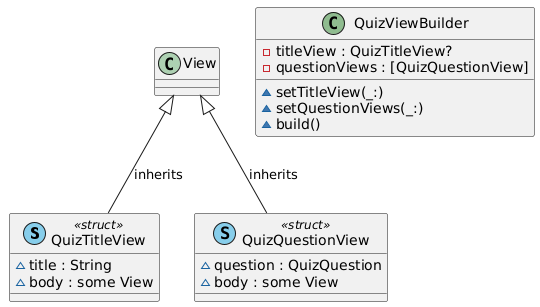

### Factory Method

Factory Method is a creational design pattern that provides an interface for creating objects in a superclass, but allows subclasses to alter the type of objects that will be created.

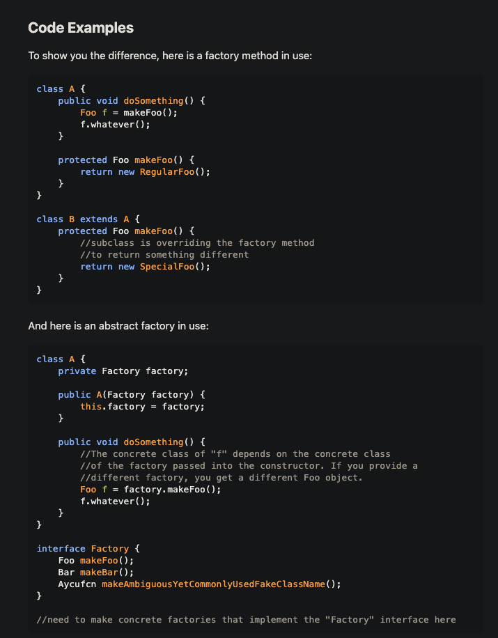

#### Pros

1. You avoid tight coupling between the creator and the concrete products.
2. Single Responsibility Principle. You can move the product creation code into one place in the program, making the code easier to support.
3. Open/Closed Principle. You can introduce new types of products into the program without breaking existing client code.

#### Cons

1. The code may become more complicated since you need to introduce a lot of new subclasses to implement the pattern. The best case scenario is when you’re introducing the pattern into an existing hierarchy of creator classes.

#### Practical examples

- Instantiating different UITableViewCell types based on data (e.g., image cell, video cell).
- Deciding which analytics service (Firebase vs. Mixpanel) to initialize at runtime.
- Creating different types of user permission objects, that would differ in parent classes.

Example 1. Creating primary and secondary buttons

```swift
// MARK: - Factory Protocol

protocol AppButtonFactoryType {
    func createButton(action: @escaping () -> Void, title: String) -> Button<Text>
}

// MARK: - Concrete Factory: Primary Button

struct PrimaryButtonFactory: AppButtonFactoryType {
    func createButton(action: @escaping () -> Void, title: String) -> Button<Text> {
        Button(action: action) {
            Text(title)
                .font(.headline)
                .foregroundStyle(.blue)
        }
    }
}

// MARK: - Concrete Factory: Secondary Button

struct SecondaryButtonFactory: AppButtonFactoryType {
    func createButton(action: @escaping () -> Void, title: String) -> Button<Text> {
        Button(action: action) {
            Text(title)
                .font(.subheadline)
                .foregroundStyle(.red)
        }
    }
}
```

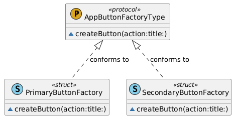

### Prototype

Prototype is a creational design pattern that lets you copy existing objects without making your code dependent on their classes.

#### Pros

1. You can clone objects without coupling to their concrete classes.
2. You can get rid of repeated initialization code in favor of cloning pre-built prototypes.
3. You can produce complex objects more conveniently.
4. You get an alternative to inheritance when dealing with configuration presets for complex objects.

#### Cons

1. Cloning complex objects that have circular references might be very tricky.

#### Practical examples

- Cloning pre-configured UIView templates (e.g., reusable storyboard-like components).
- Duplicating game characters with shared attributes (e.g., enemies in a level).
- Default usages with NSCopying.

Example 1. Cloning user

```swift
import Foundation

protocol Clonable {
    func clone() -> Self
}

final class User: NSCopying, Clonable {
    let id: Int
    let name: String
    let age: Int
    
    init(id: Int, name: String, age: Int) {
        self.id = id
        self.name = name
        self.age = age
    }
    
    init(user: User) {
        self.id = user.id
        self.name = user.name
        self.age = user.age
    }
    
    func copy(with zone: NSZone? = nil) -> Any {
        User(id: self.id, name: self.name, age: self.age)
    }
    
    func clone() -> User {
        User(id: self.id, name: self.name, age: self.age)
    }
}
```

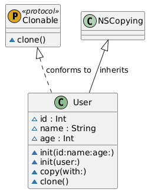

### Singleton

Singleton is a creational design pattern that lets you ensure that a class has only one instance, while providing a global access point to this instance.

#### Pros

1. You can be sure that a class has only a single instance.
2. You gain a global access point to that instance.
3. The singleton object is initialized only when it’s requested for the first time.

#### Cons

1. Violates the Single Responsibility Principle. The pattern solves two problems at the time.
2. The Singleton pattern can mask bad design, for instance, when the components of the program know too much about each other.
3. The pattern requires special treatment in a multithreaded environment so that multiple threads won’t create a singleton object several times.
4. It may be difficult to unit test the client code of the Singleton because many test frameworks rely on inheritance when producing mock objects. Since the constructor of the singleton class is private and overriding static methods is impossible in most languages, you will need to think of a creative way to mock the singleton. Or just don’t write the tests. Or don’t use the Singleton pattern.

#### Practical examples

- Managing app-wide dependencies (e.g., NetworkManager, UserDefaults wrapper).
- Centralizing logging or crash reporting services.

Example 1. App wide image loader

```swift
import UIKit
import SwiftUI

protocol ImageLoader {
    func loadImage() async throws -> UIImage
}

final class SomeLibraryImageLoader: ImageLoader {
    static let shared = SomeLibraryImageLoader()
    
    func loadImage() async throws -> UIImage {
        UIImage()
    }
}

struct SingletonSampleView: View {
    
    var body: some View {
        VStack {
            if let image {
                Image(uiImage: image)
            }
            else {
                Text("Loading...")
            }
        }
        .task {
            image = try? await SomeLibraryImageLoader.shared.loadImage()
        }
    }
    
    @State private var image: UIImage?
}
```
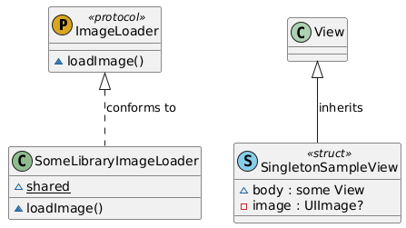

## Behavioral patterns

### Chain of Responsibility

Chain of Responsibility is a behavioral design pattern that lets you pass requests along a chain of handlers. Upon receiving a request, each handler decides either to process the request or to pass it to the next handler in the chain.

#### Pros

1. You can control the order of request handling.
2. Single Responsibility Principle. You can decouple classes that invoke operations from classes that perform operations.
3. Open/Closed Principle. You can introduce new handlers into the app without breaking the existing client code.

#### Cons

1. Some requests may end up unhandled.

#### Practical examples

- Handling touch events across nested UIView hierarchies (e.g., passing taps up the responder chain).
- Validating user input in multi-step forms (e.g., email → password → payment).

Example 1. Validators

```swift
protocol PostValidatorType: AnyObject {
    var next: (any PostValidatorType)? { get set }
    
    func validate(data: PostCreateData) -> ValidationResult
}

final class PostNameValidator: PostValidatorType {
    var next: (any PostValidatorType)?
    
    func validate(data: PostCreateData) -> ValidationResult {
        if data.name?.isEmpty ?? true {
            return .notValid(errorMessage: "Name is required")
        }
        else if data.name?.count ?? .zero > 100 {
            return .notValid(errorMessage: "Name too long")
        }
        else {
            return next?.validate(data: data) ?? .valid
        }
    }
}

final class PostContentValidator: PostValidatorType {
    var next: (any PostValidatorType)?
    
    func validate(data: PostCreateData) -> ValidationResult {
        if data.content?.isEmpty ?? true {
            return .notValid(errorMessage: "Content is required")
        }
        else if data.name?.count ?? .zero > 1_000 {
            return .notValid(errorMessage: "Content should be less than 1000 characters")
        }
        else {
            return next?.validate(data: data) ?? .valid
        }
    }
}

final class PostImageValidator: PostValidatorType {
    var next: (any PostValidatorType)?
    
    func validate(data: PostCreateData) -> ValidationResult {
        if data.postImage?.count ?? .zero > 10_000_000 {
            return .notValid(errorMessage: "Image too large")
        }
        else {
            return next?.validate(data: data) ?? .valid
        }
    }
}
```

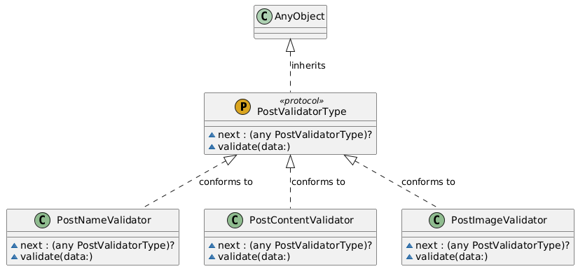

Example 2. Data fetch from different sources

```swift
import Foundation

struct PostModel {
    let id: String
    let name: String
    let contennt: String
    let imageURL: URL?
}

protocol PostProviderType: AnyObject {
    var next: PostProviderType? { get set }
    
    func getData() async throws -> [PostModel]
}

final class LocalDataProvider: PostProviderType {
    var next: (any PostProviderType)?
    
    func getData() async throws -> [PostModel] {
        do {
            let data = [PostModel(id: "123", name: "Name", contennt: "Content", imageURL: nil)]
            
            return data
        }
        catch {
            if let next = next {
                return try await next.getData()
            }
            else {
                throw error
            }
        }
    }
}

final class RemoteDataProvider: PostProviderType {
    enum TestError: LocalizedError {
        case networkError
    }
    
    var next: (any PostProviderType)?
    
    func getData() async throws -> [PostModel] {
        do {
            // Perform some fetching from the server
            throw TestError.networkError
        }
        catch {
            if let next = next {
                return try await next.getData()
            }
            else {
                throw error
            }
        }
    }
}

final class PostRepository {
    private var rootDataProvider: (any PostProviderType)?
    
    init() {
        setup()
    }
    
    func getData() async throws -> [PostModel] {
        try await rootDataProvider?.getData() ?? []
    }
    
    private func setup() {
        let local = LocalDataProvider()
        let remote = RemoteDataProvider()
        remote.next = local
        
        self.rootDataProvider = remote
    }
}
```

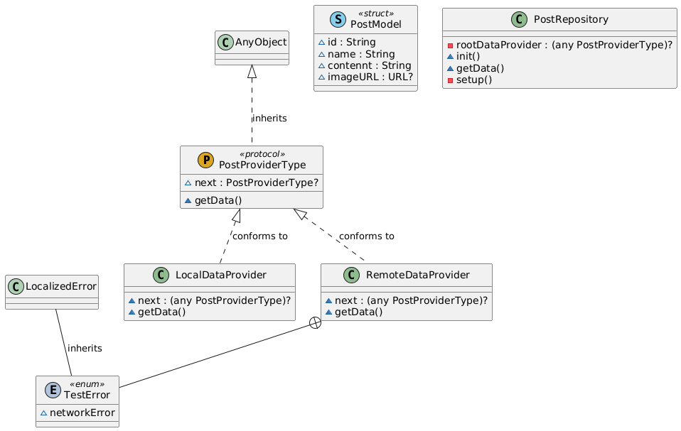

### Command

Command is a behavioral design pattern that turns a request into a stand-alone object that contains all information about the request. This transformation lets you pass requests as a method arguments, delay or queue a request’s execution, and support undoable operations.

#### Pros

1. Single Responsibility Principle. You can decouple classes that invoke operations from classes that perform these operations.
2. Open/Closed Principle. You can introduce new commands into the app without breaking existing client code.
3. You can implement undo/redo.
4. You can implement deferred execution of operations.
5. You can assemble a set of simple commands into a complex one.

#### Cons

1. The code may become more complicated since you’re introducing a whole new layer between senders and receivers.

#### Practical examples

- Implementing undo/redo in a drawing app (e.g., brush strokes, color changes).
- Queuing network requests for retry or prioritization.

Example 1. Transaction command of order create and processing.

```swift
import Foundation

protocol OrderCommandType {
    func execute(on order: inout Order) throws
    func undo(on order: inout Order) throws
}

final class CreateOrderCommand: OrderCommandType {
    func execute(on order: inout Order) {
        order.status = "Created"
        debugPrint("Order status: \(order.status)")
    }

    func undo(on order: inout Order) {
        order.status = "None"
        debugPrint("Order creation undone. Status: \(order.status)")
    }
}

final class PayOrderCommand: OrderCommandType {
    func execute(on order: inout Order) {
        order.isPaid = true
        debugPrint("Order paid")
    }

    func undo(on order: inout Order) {
        order.isPaid = false
        debugPrint("Payment undone")
    }
}

final class PlaceOrderCommand: OrderCommandType {
    func execute(on order: inout Order) {
        order.isPlaced = true
        debugPrint("Order placed")
    }

    func undo(on order: inout Order) {
        order.isPlaced = false
        debugPrint("Order placement undone")
    }
}

final class TransactionCommand: OrderCommandType {
    private var commands: [OrderCommandType] = []

    func add(command: OrderCommandType) {
        commands.append(command)
    }

    func execute(on order: inout Order) throws {
        for command in commands {
           try command.execute(on: &order)
        }
    }

    func undo(on order: inout Order) throws {
        for command in commands.reversed() {
            try command.undo(on: &order)
        }
    }
}
```
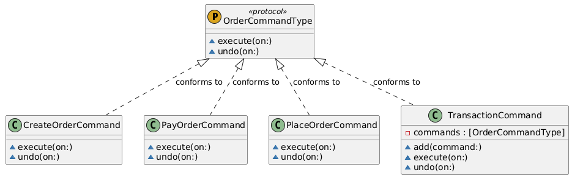

### Interpreter

The Interpreter Design Pattern is a behavioral design pattern used to define a language’s grammar and provide an interpreter to process statements in that language. It is useful for parsing and executing expressions or commands in a system. By breaking down complex problems into smaller, understandable pieces, this pattern simplifies the interpretation of structured data.

#### Practical examples

- processing some data to transform into other.
- formatting something

Example 1. App price interpreter

```swift
import SwiftUI

protocol NumberInterpreteur {
    func interpret(number: Decimal) -> String?
}

final class AppPriceInterpreter: NumberInterpreteur {
    
    private let shortingTrashhold: Decimal = 1_000
    
    private let fullNumberFormatter: NumberFormatter = {
        let formatter = NumberFormatter()
        formatter.numberStyle = .currency
        formatter.currencyCode = "USD"
        return formatter
    }()
    
    private let shortNubmerFormatter: NumberFormatter = {
        let formatter = NumberFormatter()
        formatter.numberStyle = .currency
        formatter.currencyCode = "USD"
        return formatter
    }()
        
    func interpret(number: Decimal) -> String? {
        if abs(number) > shortingTrashhold {
            return shortNubmerFormatter.string(from: NSDecimalNumber(decimal: number))
        }
        else {
            return fullNumberFormatter.string(from: NSDecimalNumber(decimal: number))
        }
    }
}
```
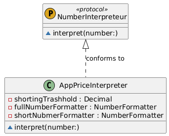

### Iterator

Iterator is a behavioral design pattern that lets you traverse elements of a collection without exposing its underlying representation (list, stack, tree, etc.).

#### Pros

1. Single Responsibility Principle. You can clean up the client code and the collections by extracting bulky traversal algorithms into separate classes.
2. Open/Closed Principle. You can implement new types of collections and iterators and pass them to existing code without breaking anything.
3. You can iterate over the same collection in parallel because each iterator object contains its own iteration state.
4. For the same reason, you can delay an iteration and continue it when needed.

#### Cons

1. Applying the pattern can be an overkill if your app only works with simple collections.
2. Using an iterator may be less efficient than going through elements of some specialized collections directly.

#### Practical examples

- Traversing collections of posts in a social media feed (e.g., paginated API responses).
- Looping through UICollectionView cells for batch updates.

Example 1. Playlist iterator

```swift
// MARK: - Song Model
struct Song {
    let title: String
    let artist: String
    let isFavorite: Bool
}

// MARK: - Playlist Iterator
struct PlaylistIterator: IteratorProtocol {
    private var songs: [Song]
    private var index = 0
    private var skipNonFavorites: Bool

    init(songs: [Song], skipNonFavorites: Bool = false) {
        self.songs = songs
        self.skipNonFavorites = skipNonFavorites
    }

    mutating func next() -> Song? {
        while index < songs.count {
            let song = songs[index]
            index += 1

            if skipNonFavorites && !song.isFavorite {
                continue
            }
            return song
        }
        return nil
    }
}

// MARK: - Playlist Sequence
struct Playlist: Sequence {
    private var songs: [Song]

    init(songs: [Song]) {
        self.songs = songs
    }
    
    func makeIterator() -> some IteratorProtocol {
        PlaylistIterator(songs: songs)
    }

    func makeIterator(skipNonFavorites: Bool = false) -> PlaylistIterator {
        PlaylistIterator(songs: songs, skipNonFavorites: skipNonFavorites)
    }
}
```

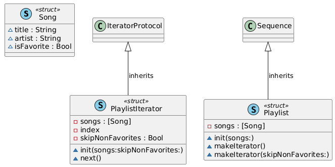

### Mediator

Mediator is a behavioral design pattern that lets you reduce chaotic dependencies between objects. The pattern restricts direct communications between the objects and forces them to collaborate only via a mediator object.

#### Pros

1. Single Responsibility Principle. You can extract the communications between various components into a single place, making it easier to comprehend and maintain.
2. Open/Closed Principle. You can introduce new mediators without having to change the actual components.
3. You can reduce coupling between various components of a program.
4. You can reuse individual components more easily.

#### Cons

1. Over time a mediator can evolve into a God Object.

#### Practical examples

- Coordinating communication between view controllers in a tab-based app.
- Managing real-time chat room participants (e.g., sending messages to all users).
- Handle complex flows
- view sync
- game logic coordinator

Example 1. Peer to peer chat

```swift 
protocol ChatUserType: AnyObject, Identifiable {
    func sendMessage(message: String)
    func receiveMessage(message: String)
}

final class ChatUser: ChatUserType {
    
    var id: String = UUID().uuidString
    
    private var mediator: any ChatMediatorType
    private var name: String
    
    init(name: String, mediator: any ChatMediatorType) {
        self.mediator = mediator
        self.name = name
    }
    
    func sendMessage(message: String) {
        mediator.sendMessage(message: message, user: self)
    }
    
    func receiveMessage(message: String) {
        debugPrint("\(name) received message: \(message)")
    }
}

protocol ChatMediatorType {
    func sendMessage(message: String, user: any ChatUserType)
}

final class ChatRoom: ObservableObject, ChatMediatorType {
    private var users: [any ChatUserType] = []
    
    func addUser(user: any ChatUserType) {
        users.append(user)
    }
    
    func sendMessage(message: String, user: any ChatUserType) {
        for participant in users where participant.id != user.id {
            participant.receiveMessage(message: message)
        }
    }
}
```
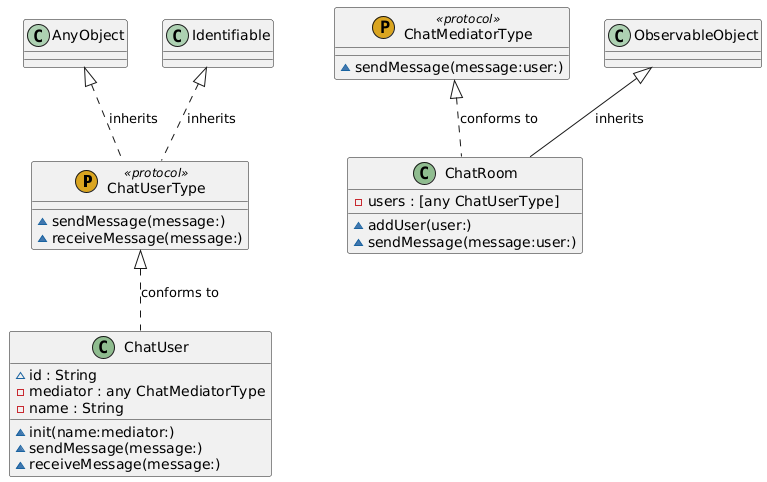

### Memento

Memento is a behavioral design pattern that lets you save and restore the previous state of an object without revealing the details of its implementation.

#### Pros

1. You can produce snapshots of the object’s state without violating its encapsulation.
2. You can simplify the originator’s code by letting the caretaker maintain the history of the originator’s state.

#### Cons

1. The app might consume lots of RAM if clients create mementos too often.
2. Caretakers should track the originator’s lifecycle to be able to destroy obsolete mementos.
3. Most dynamic programming languages, such as PHP, Python and JavaScript, can’t guarantee that the state within the memento stays untouched.

#### Practical examples

- Saving/restoring app state (e.g., game progress, form data) during backgrounding.
- Implementing "snapshots" for version history in a note-taking app.
- game state, navigation
- files changes history

Example 1. Text editor

```swift
import SwiftUI

class TextEditorViewModel: ObservableObject {
    struct Memento {
        let state: String
    }
    
    @Published private(set) var text: String = ""
    private var history: [Memento] = []
    private var currentIndex: Int = 0

    func updateText(_ newText: String) {
        if currentIndex < history.count - 1 {
            history = Array(history.prefix(upTo: currentIndex + 1))
        }
        
        text = newText
        history.append(Memento(state: text))
        currentIndex = history.count - 1
    }

    func undo() {
        guard currentIndex > 0 else {
            return
        }
        
        currentIndex -= 1
        text = history[currentIndex].state
    }

    func redo() {
        guard currentIndex < history.count - 1 else {
            return
        }
        
        currentIndex += 1
        text = history[currentIndex].state
    }
}
```

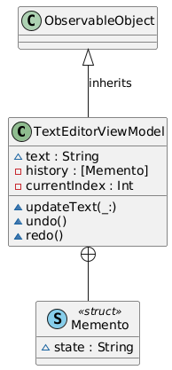

### Observer

Observer is a behavioral design pattern that lets you define a subscription mechanism to notify multiple objects about any events that happen to the object they’re observing.

#### Pros

1. Open/Closed Principle. You can introduce new subscriber classes without having to change the publisher’s code (and vice versa if there’s a publisher interface).
2. You can establish relations between objects at runtime.

#### Cons

1. Subscribers are notified in random order.

#### Practical examples

- Updating UI when data changes (e.g., SwiftUI @Published properties, Combine subscriptions).
- Syncing settings across devices using NotificationCenter.
- combine, rxswift, notification center etc.

Example 1. List with details

```swift
struct Book {
    let id: String
    let name: String
    let author: String
    var isFavorite: Bool
}

protocol BookRepositoryType {
    var bookFavoriteStatusChangedPublisher: AnyPublisher<Book, Never> { get }
    
    func addToFavorites(book: Book)
    func removeFromFavorites(book: Book)
}

final class BookRepository: ObservableObject, BookRepositoryType {
    var bookFavoriteStatusChangedPublisher: AnyPublisher<Book, Never> {
        rawBookFavoriteStatusChangedPublisher.eraseToAnyPublisher()
    }
    
    private let rawBookFavoriteStatusChangedPublisher: PassthroughSubject<Book, Never> = .init()
    
    func addToFavorites(book: Book) {
        var mutatingBook = book
        mutatingBook.isFavorite = true
        rawBookFavoriteStatusChangedPublisher.send(mutatingBook)
    }
    
    func removeFromFavorites(book: Book) {
        var mutatingBook = book
        mutatingBook.isFavorite = false
        rawBookFavoriteStatusChangedPublisher.send(mutatingBook)
    }
}

class BookListViewModel: ObservableObject {
    @Published var books: [Book] = [
        Book(id: "1", name: "Book One", author: "Author A", isFavorite: false),
        Book(id: "2", name: "Book Two", author: "Author B", isFavorite: false),
        Book(id: "3", name: "Book Three", author: "Author C", isFavorite: false)
    ]
    
    private var cancellables: Set<AnyCancellable> = []
    private let repository: BookRepositoryType

    init(repository: BookRepositoryType) {
        self.repository = repository
        
        repository.bookFavoriteStatusChangedPublisher
            .sink { [weak self] updatedBook in
                guard let self = self else {
                    return
                }
                
                if let index = self.books.firstIndex(where: { $0.id == updatedBook.id }) {
                    self.books[index] = updatedBook
                }
            }
            .store(in: &cancellables)
    }
    
    func toggleFavorite(for book: Book) {
        if book.isFavorite {
            repository.removeFromFavorites(book: book)
        } else {
            repository.addToFavorites(book: book)
        }
    }
}

// MARK: - Views
struct BookListView: View {
    @StateObject private var viewModel = BookListViewModel(repository: BookRepository())
    
    var body: some View {
        NavigationView {
            List {
                ForEach(viewModel.books, id: \.id) { book in
                    NavigationLink(destination: BookDetailView(book: book, viewModel: viewModel)) {
                        HStack {
                            Text(book.name)
                            
                            Spacer()
                            
                            Image(systemSymbol: book.isFavorite ? SFSymbol.starFill : SFSymbol.star)
                                .foregroundColor(.yellow)
                        }
                    }
                }
            }
            .navigationTitle("Books")
        }
    }
}

struct BookDetailView: View {
    let book: Book
    @ObservedObject var viewModel: BookListViewModel

    var body: some View {
        VStack(spacing: 16) {
            Text(book.name)
                .font(.largeTitle)
            Text("By \(book.author)")
                .font(.title2)
                .foregroundColor(.gray)

            Button(
                action: {
                    viewModel.toggleFavorite(for: book)
                },
                label: {
                    Text(book.isFavorite ? "Remove from Favorites" : "Add to Favorites")
                        .padding()
                        .background(book.isFavorite ? Color.red : Color.blue)
                        .foregroundColor(.white)
                        .cornerRadius(8)
                }
            )
        }
        .padding()
        .navigationTitle("Details")
    }
}
```
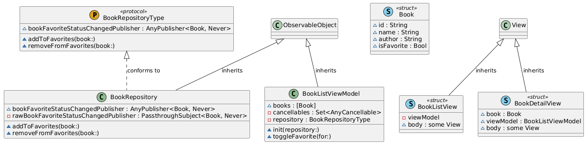

### State

State is a behavioral design pattern that lets an object alter its behavior when its internal state changes. It appears as if the object changed its class.

#### Pros

1. Single Responsibility Principle. Organize the code related to particular states into separate classes.
2. Open/Closed Principle. Introduce new states without changing existing state classes or the context.
3. Simplify the code of the context by eliminating bulky state machine conditionals.

#### Cons

1. Applying the pattern can be overkill if a state machine has only a few states or rarely changes.

#### Practical examples

- Managing playback states in a music app (playing, paused, buffering).
- Handling authentication states (logged in, guest, expired session).

Example 1. Player state

```swift
import SwiftUI
import SFSafeSymbols
import Combine

protocol MediaPlayerStateType {
    var playerView: AnyView { get }
    var title: String { get }
    
    func play(context: MediaPlayer)
    func pause(context: MediaPlayer)
    func stop(context: MediaPlayer)
}

final class PlayingState: MediaPlayerStateType {
    var playerView: AnyView {
        AnyView(
            VStack {
                Text("Playing...")
                    .font(.largeTitle)
                    .padding()
                
                Image(systemSymbol: SFSymbol.playCircleFill)
                    .resizable()
                    .frame(width: 100, height: 100)
                    .foregroundColor(.green)
            }
        )
    }
    
    var title: String {
        "Playing"
    }
    
    func play(context: MediaPlayer) {
        print("Already playing")
    }
    
    func pause(context: MediaPlayer) {
        context.setState(PausedState())
    }
    
    func stop(context: MediaPlayer) {
        context.setState(IdleState())
    }
}

final class PausedState: MediaPlayerStateType {
    var playerView: AnyView {
        AnyView(
            VStack {
                Text("Paused")
                    .font(.largeTitle)
                    .padding()
                
                Image(systemSymbol: SFSymbol.pauseCircleFill)
                    .resizable()
                    .frame(width: 100, height: 100)
                    .foregroundColor(.yellow)
            }
        )
    }
    
    var title: String {
        "Paused"
    }
    
    func play(context: MediaPlayer) {
        context.setState(PlayingState())
    }
    
    func pause(context: MediaPlayer) {
        debugPrint("Already paused")
    }
    
    func stop(context: MediaPlayer) {
        context.setState(IdleState())
    }
}

final class IdleState: MediaPlayerStateType {
    var playerView: AnyView {
        AnyView(
            VStack {
                Text("Idle")
                    .font(.largeTitle)
                    .padding()
                
                Image(systemSymbol: SFSymbol.stopCircleFill)
                    .resizable()
                    .frame(width: 100, height: 100)
                    .foregroundColor(.gray)
            }
        )
    }
    
    var title: String {
        "Idle"
    }
    
    func play(context: MediaPlayer) {
        context.setState(PlayingState())
    }
    
    func pause(context: MediaPlayer) {
        context.setState(PausedState())
    }
    
    func stop(context: MediaPlayer) {
        debugPrint("Already iddle")
    }
}

final class MediaPlayer: ObservableObject {
    
    var stateChangedPublisher: AnyPublisher<any MediaPlayerStateType, Never> {
        rawStateChangedPublisher.eraseToAnyPublisher()
    }
    
    var state: any MediaPlayerStateType = IdleState() {
        didSet {
            rawStateChangedPublisher.send(state)
        }
    }
    
    private let rawStateChangedPublisher: PassthroughSubject<any MediaPlayerStateType, Never> = .init()
        
    func setState(_ newState: MediaPlayerStateType) {
        state = newState
    }
    
    func play() {
        state.play(context: self)
    }
    
    func pause() {
        state.pause(context: self)
    }
    
    func stop() {
        state.stop(context: self)
    }
}

struct MediaPlayerView: View {
    @StateObject private var mediaPlayer = MediaPlayer()
    @State private var currentState: MediaPlayerStateType = IdleState()
    
    var body: some View {
        VStack(spacing: 20) {
            // State title
            Text(currentState.title)
                .font(.headline)
            
            // Display the current state's view
            currentState.playerView

            // Control buttons
            HStack(spacing: 20) {
                Button(
                    action: { mediaPlayer.play() },
                    label: {
                        Text("Play")
                            .padding()
                            .frame(maxWidth: .infinity)
                            .background(Color.green)
                            .foregroundColor(.white)
                            .cornerRadius(8)
                    }
                )

                Button(
                    action: { mediaPlayer.pause() },
                    label: {
                        Text("Pause")
                            .padding()
                            .frame(maxWidth: .infinity)
                            .background(Color.orange)
                            .foregroundColor(.white)
                            .cornerRadius(8)
                    }
                )

                Button(
                    action: { mediaPlayer.stop() },
                    label: {
                        Text("Stop")
                            .padding()
                            .frame(maxWidth: .infinity)
                            .background(Color.red)
                            .foregroundColor(.white)
                            .cornerRadius(8)
                    }
                )
            }
        }
        .padding()
        .onReceive(mediaPlayer.stateChangedPublisher) { newState in
            currentState = newState
        }
        .navigationTitle("Media Player")
    }
}
```
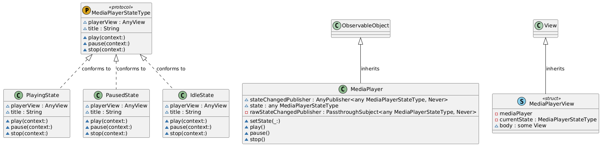

### Strategy

Strategy is a behavioral design pattern that lets you define a family of algorithms, put each of them into a separate class, and make their objects interchangeable.

#### Pros

1. You can swap algorithms used inside an object at runtime.
2. You can isolate the implementation details of an algorithm from the code that uses it.
3. You can replace inheritance with composition.
4. Open/Closed Principle. You can introduce new strategies without having to change the context.

#### Cons

1. If you only have a couple of algorithms and they rarely change, there’s no real reason to overcomplicate the program with new classes and interfaces that come along with the pattern.
2. Clients must be aware of the differences between strategies to be able to select a proper one.
3. A lot of modern programming languages have functional type support that lets you implement different versions of an algorithm inside a set of anonymous functions. Then you could use these functions exactly as you’d have used the strategy objects, but without bloating your code with extra classes and interfaces.

#### Practical examples

- Switching image compression algorithms (JPEG vs. PNG) based on user preferences.
- A/B testing different onboarding flows or UI layouts.

Example 1. Pay with different services

```swift
import SwiftUI

protocol PaymentStrategy {
    func pay(amount: Double)
}

class CreditCardPayment: PaymentStrategy {
    func pay(amount: Double) {
        print("Paid \(amount) using Credit Card.")
    }
}

class PayPalPayment: PaymentStrategy {
    func pay(amount: Double) {
        print("Paid \(amount) using PayPal.")
    }
}

class PaymentProcessor {
    private var strategy: PaymentStrategy

    init(strategy: PaymentStrategy) {
        self.strategy = strategy
    }

    func setStrategy(_ strategy: PaymentStrategy) {
        self.strategy = strategy
    }

    func processPayment(amount: Double) {
        strategy.pay(amount: amount)
    }
}
```

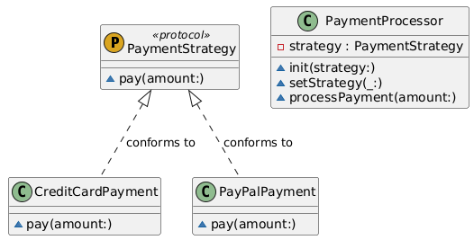

### Template method

Template Method is a behavioral design pattern that defines the skeleton of an algorithm in the superclass but lets subclasses override specific steps of the algorithm without changing its structure.

#### Pros

1. You can let clients override only certain parts of a large algorithm, making them less affected by changes that happen to other parts of the algorithm.
2. You can pull the duplicate code into a superclass.

#### Cons

1. Some clients may be limited by the provided skeleton of an algorithm.
2. You might violate the Liskov Substitution Principle by suppressing a default step implementation via a subclass.
3. Template methods tend to be harder to maintain the more steps they have.

#### Practical examples

- Defining a base algorithm for API requests (setup → execute → handle errors) with customizable steps.
- Standardizing UIViewController lifecycle hooks (e.g., viewDidLoad, viewWillAppear).

Example 1. Template method view builder

```swift
import SwiftUI

protocol ViewTemplate {
    func prepareHeader() -> AnyView
    func prepareBody() -> AnyView
    func prepareFooter() -> AnyView

    func renderView() -> AnyView
}

extension ViewTemplate {
    func renderView() -> AnyView {
        AnyView(
            VStack(spacing: 20) {
                prepareHeader()
                prepareBody()
                prepareFooter()
            }
            .padding()
        )
    }
}

class InvoiceView: ViewTemplate {
    func prepareHeader() -> AnyView {
        AnyView(Text("📄 Invoice").font(.largeTitle).padding())
    }

    func prepareBody() -> AnyView {
        AnyView(Text("Amount: $500\nDue Date: 01-Feb-2025").multilineTextAlignment(.center))
    }

    func prepareFooter() -> AnyView {
        AnyView(Text("Thank you for your business!").font(.footnote))
    }
}

class ReportView: ViewTemplate {
    func prepareHeader() -> AnyView {
        AnyView(Text("📊 Report").font(.largeTitle).padding())
    }

    func prepareBody() -> AnyView {
        AnyView(Text("Report Content: Sales increased by 20% this quarter.").multilineTextAlignment(.center))
    }

    func prepareFooter() -> AnyView {
        AnyView(Text("Generated on: 01-Feb-2025").font(.footnote))
    }
}

struct TemplateMethodView: View {
    var body: some View {
        VStack(spacing: 20) {
            InvoiceView().renderView()
            ReportView().renderView()
        }
        .padding()
        .navigationTitle("Template Method Pattern")
    }
}
```


### Visitor

Visitor is a behavioral design pattern that lets you separate algorithms from the objects on which they operate.

#### Pros
 
1. Open/Closed Principle. You can introduce a new behavior that can work with objects of different classes without changing these classes.
2. Single Responsibility Principle. You can move multiple versions of the same behavior into the same class.
3. A visitor object can accumulate some useful information while working with various objects. This might be handy when you want to traverse some complex object structure, such as an object tree, and apply the visitor to each object of this structure.

#### Cons

1. You need to update all visitors each time a class gets added to or removed from the element hierarchy.
2. Visitors might lack the necessary access to the private fields and methods of the elements that they’re supposed to work with.

#### Practical examples

- Generating analytics reports for different UI elements (buttons, screens, gestures).
- Exporting app content to multiple formats (PDF, HTML, CSV).
- loggers

```swift
protocol ExportVisitable: Hashable {
    func accept(visitor: ExportVisitor)
}

protocol ExportVisitor {
    var result: String { get }
    
    func visitUser(_ user: VisitorUser)
    func visitOrder(_ order: VisitorOrder)
}

final class VisitorUser: ExportVisitable {
    let name: String
    let email: String

    init(name: String, email: String) {
        self.name = name
        self.email = email
    }
    
    static func == (lhs: VisitorUser, rhs: VisitorUser) -> Bool {
        lhs.name == rhs.name && lhs.email == rhs.email
    }

    func accept(visitor: ExportVisitor) {
        visitor.visitUser(self)
    }
    
    func hash(into hasher: inout Hasher) {
        hasher.combine(name)
        hasher.combine(email)
    }
}

class VisitorOrder: ExportVisitable {
    let orderId: String
    let amount: Double

    init(orderId: String, amount: Double) {
        self.orderId = orderId
        self.amount = amount
    }
    
    static func == (lhs: VisitorOrder, rhs: VisitorOrder) -> Bool {
        lhs.orderId == rhs.orderId && lhs.amount == rhs.amount
    }

    func accept(visitor: ExportVisitor) {
        visitor.visitOrder(self)
    }
    
    func hash(into hasher: inout Hasher) {
        hasher.combine(orderId)
        hasher.combine(amount)
    }
}

class JSONExportVisitor: ExportVisitor {
    private(set) var result: String = ""

    func visitUser(_ user: VisitorUser) {
        result = "{\"name\": \"\(user.name)\", \"email\": \"\(user.email)\"}"
    }

    func visitOrder(_ order: VisitorOrder) {
        result = "{\"orderId\": \"\(order.orderId)\", \"amount\": \(order.amount)}"
    }
}

class XMLExportVisitor: ExportVisitor {
    private(set) var result: String = ""

    func visitUser(_ user: VisitorUser) {
        result = "<user><name>\(user.name)</name><email>\(user.email)</email></user>"
    }

    func visitOrder(_ order: VisitorOrder) {
        result = "<order><orderId>\(order.orderId)</orderId><amount>\(order.amount)</amount></order>"
    }
}
```

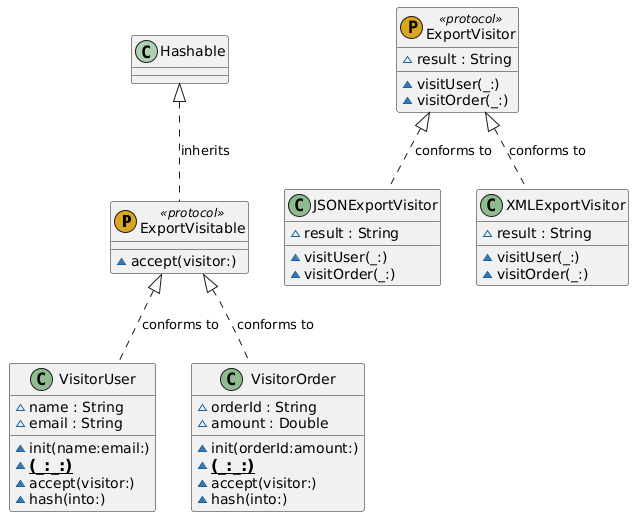


## Resources

1. Refactoring guru (https://refactoring.guru/design-patterns).
2. Digital ocean article (https://www.digitalocean.com/community/tutorials/gangs-of-four-gof-design-patterns).
3. Plant uml (https://www.planttext.com/)
4. Swifty nomad articles (https://swiftlynomad.medium.com/).